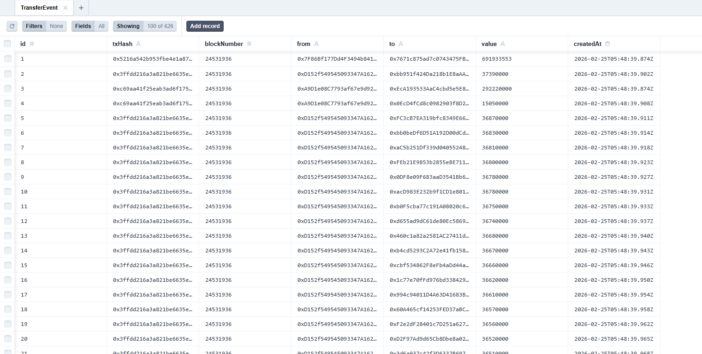

| Command | Description |
|---------|-------------|
| `npm run dev` | Start with hot reload |
| `npm start` | Start without hot reload |
| `npx prisma studio` | Open database UI |

---

This project currently indexes USDC transfers only. To add another ERC20 token, add a new contract listener in `listener.ts` with the token's contract address 

SQLite is used for local development

api endpoint is http://localhost:3000/api/events